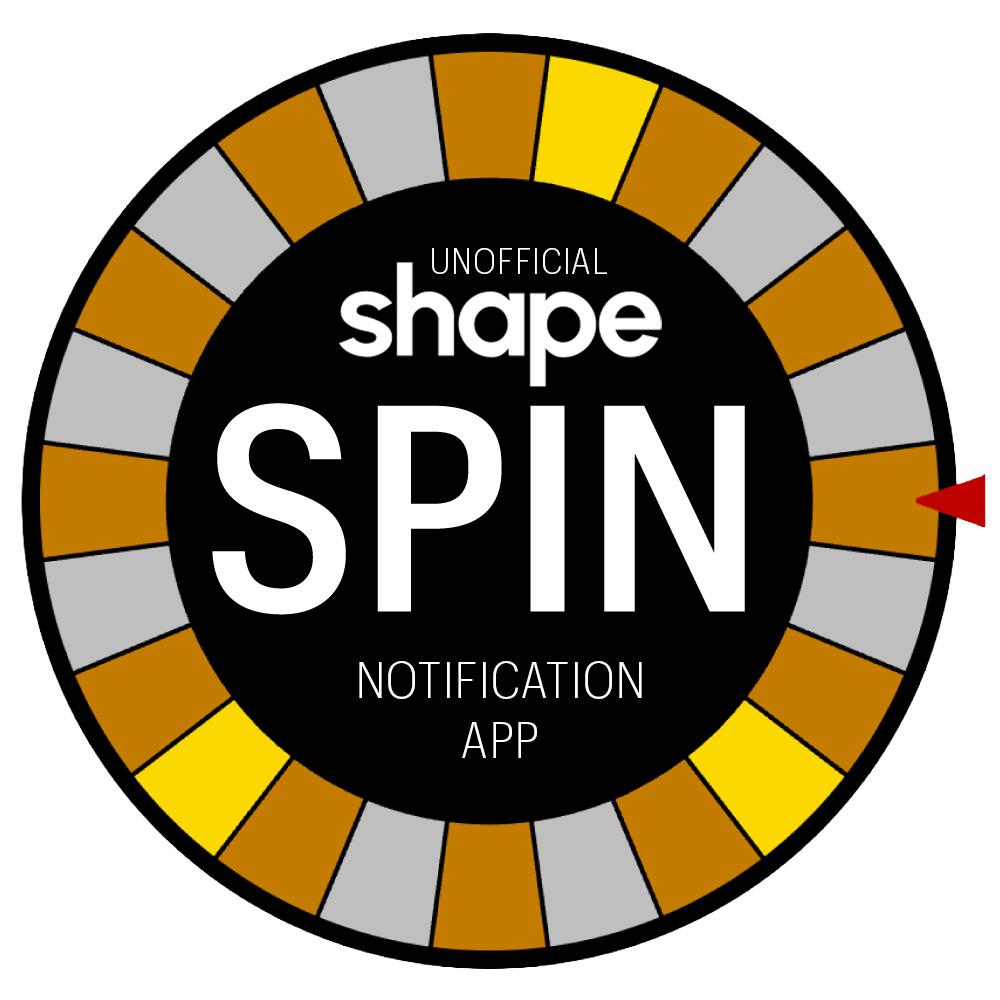

# 🌀 Shape Medal Spin Notification App



**Demo Instance: [https://spin-shape.vercel.app/](https://spin-shape.vercel.app/)**

Automated daily spin status iMessage notification for the Shape Network [Medal Spin Game](https://stack.shape.network/medal-spin).

## Overview

This project monitors your wallet on the [MedalSpin contract](https://shapescan.xyz/address/0x99BB9Dca4F8Ed3FB04eCBE2bA9f5f378301DBaC1) and sends you iMessage notifications when you can spin. It tracks the 24-hour cooldown period between spins.

## Features

- 🤖 **Spin Monitoring** - Checks regularly when your next spin is available (configurable interval)
- 📱 **iMessage/SMS Notifications** - Get alerted promptly when spin is available (automatic SMS fallback)
- 🔒 **Secure** - Uses public addresses only, no private keys needed for monitoring
- 📊 **Dashboard** - Real-time schedule tracking and spin history
- 🎯 **Efficient** - Uses Alchemy RPC for reliability
- ⚡ **Fast** - Timely notifications based on your configured check interval

## How It Works

1. **Vercel Cron Job** runs at your configured interval to check spin availability
2. **Smart Monitor** checks if you can spin on the blockchain
3. **Notification** sends iMessage when ready (automatic SMS fallback if needed)
4. **Manual Spin** - Click the link to open MetaMask and spin

## Shape MedalSpin Contract Details

- **Address**: [`0x99BB9Dca4F8Ed3FB04eCBE2bA9f5f378301DBaC1`](https://shapescan.xyz/address/0x99BB9Dca4F8Ed3FB04eCBE2bA9f5f378301DBaC1)
- **Network**: Shape Mainnet (Chain ID: 360)
- **Method**: `spin(bytes32 hash)`
- **ABI**: [View on ShapeScan](https://shapescan.xyz/address/0x99BB9Dca4F8Ed3FB04eCBE2bA9f5f378301DBaC1?tab=contract_abi)

## Setup

### Prerequisites
- Node.js 18+
- **Vercel Pro account** ($20/month - required for timely notifications)
- **LoopMessage account** (if you want to receive iMessage/SMS notifications) - [Sign up at loopmessage.com](https://loopmessage.com)
- Public wallet address to monitor

### Installation

1. Clone the repository:
```bash
git clone https://github.com/yourusername/spin-shape.git
cd spin-shape
```

2. Install dependencies:
```bash
npm install
```

3. Configure environment variables:
```env
PUBLIC_ADDRESS=0x...  # Wallet address to monitor
ALCHEMY_API_KEY=your_key  # Optional but recommended for reliability
CRON_INTERVAL_MINUTES=5  # How often to check (5, 10, 15, 30, etc.)

# For iMessage text notifications (optional):
LOOPMESSAGE_AUTH_KEY=your_auth_key
LOOPMESSAGE_SECRET_KEY=your_secret_key
NOTIFICATION_NUMBER=+1234567890
```

4. Deploy to Vercel:
```bash
vercel --prod
```

## Routes & Endpoints

### 🏠 `/` 
Main dashboard showing:
- Current spin count
- Last spin time
- Next scheduled spin
- Can spin now status
- Complete spin history
- Live timer updates
- ENS name resolution
- Monitoring wallet address

### 📅 `/api/status`
JSON API returning spin status data (used by dashboard)

### 🔧 `/api/debug`
Technical details including:
- Contract read methods
- Spin time gaps analysis
- Hash verification

### 🔔 `/api/cron-check-and-notify`
Cron endpoint that checks if you can spin and sends notifications

## Schedule Logic

The bot tracks a simple 24-hour cooldown period:

- Each spin becomes available exactly 24 hours after your last spin
- Notifications are sent at the next cron interval after availability
- Cron interval is configurable via `CRON_INTERVAL_MINUTES` environment variable

### Dynamic Cron Configuration

The cron schedule is dynamically generated during deployment:

1. Set `CRON_INTERVAL_MINUTES` in your Vercel environment variables (e.g., `5`, `10`, `30`)
2. During deployment, `vercel-build` script generates `vercel.json` from `vercel.template.json`
3. The generated cron schedule matches your configured interval
4. Dashboard automatically displays accurate notification timing

To change the check interval:
- Update `CRON_INTERVAL_MINUTES` in Vercel dashboard
- Redeploy your application
- The new schedule takes effect immediately

## Security

- ✅ Read-only operations (no private keys needed)
- ✅ Public address monitoring only
- ✅ Environment variables for API credentials
- ✅ Rate limiting through Vercel

## Development

Run locally:
```bash
npx vercel dev --listen 4000
```

View logs:
```bash
vercel logs
```

## Important Notes

- **Requires Vercel Pro** ($20/month) - Free tier's once-daily check is useless for this use case
- This bot only monitors and notifies - it does NOT automatically spin
- You must manually spin through Shape's website or MetaMask
- Medal outcomes are determined when you visit the Shape Medal site
- Notifications include a MetaMask deep link for quick access

## Support

Support open source software! Tips appreciated.
- **ETH**: `0x56bdE1E5efC80B1E2B958f2D311f4176945Ae77f`
- **SOL**: `4ReFALhC44f2V3x14MkVQGjXUPTnXRzwUdJuvRkU8KBG`

## License

ISC
