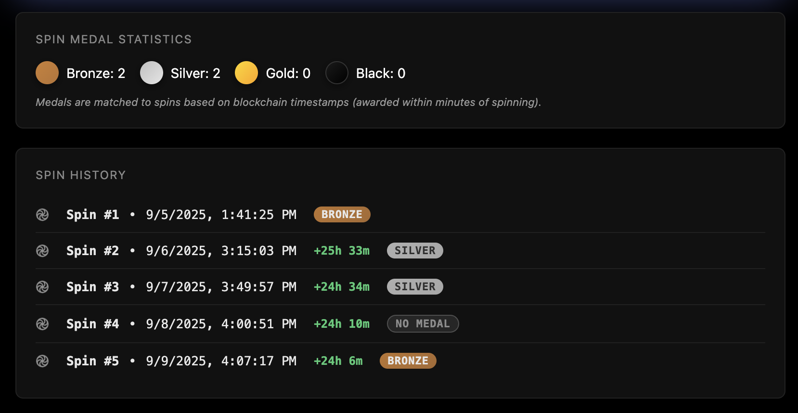

# 🌀 Shape Medal Spin Notification App 🌀

<div align="center">
  
  <br><br>
  
  [](https://spin-shape.vercel.app/) [](https://spin-shape.vercel.app/api/status) [](https://github.com/jmsaavedra/shape-spin-notification) [](https://github.com/jmsaavedra/shape-spin-notification) [](LICENSE)
</div>

**Live Demo Instance: [https://spin-shape.vercel.app/](https://spin-shape.vercel.app/)**

Automated daily spin status iMessage notification for the Shape Network [Medal Spin Game](https://stack.shape.network/medal-spin). Never miss a daily spin again!

## Overview

This project monitors your wallet on the [MedalSpin contract](https://shapescan.xyz/address/0x99BB9Dca4F8Ed3FB04eCBE2bA9f5f378301DBaC1) and sends you iMessage notifications when you can spin. It tracks the 24-hour cooldown period between spins.

## Features

- 🤖 **Spin Monitoring** - Checks regularly when your next spin is available (configurable interval)
- 📱 **iMessage/SMS Notifications** - Get alerted promptly when spin is available (automatic SMS fallback)
- 🔒 **Secure** - Uses public addresses only, no private keys needed for monitoring
- 📊 **Dashboard** - Real-time schedule tracking and spin history
- 🏅 **Medal Tracking** - Displays your MEDAL-SPIN medals (Bronze, Silver, Gold, Diamond) with stats
- 🏆 **Black Medal Raffle** - Track your eligibility for weekly Black medal raffles (7-day streak required)
- 🎯 **Efficient** - 90% reduction in API calls through intelligent polling
- ⚡ **Smart Polling** - Dynamic intervals based on proximity to spin time (10s to 5min)
- 🔄 **Multicall3** - Batches contract reads into single RPC calls
- 💾 **Intelligent Caching** - ENS names, spin history, and medal data cached smartly

## How It Works

1. **Vercel Cron Job** runs at your configured interval to check spin availability
2. **Smart Monitor** checks if you can spin on the blockchain
3. **Notification** sends iMessage when ready (automatic SMS fallback if needed)
4. **Manual Spin** - Click the link to open MetaMask and spin

## Shape Contract Details

### MedalSpin Contract
- **Address**: [`0x99BB9Dca4F8Ed3FB04eCBE2bA9f5f378301DBaC1`](https://shapescan.xyz/address/0x99BB9Dca4F8Ed3FB04eCBE2bA9f5f378301DBaC1)
- **Network**: Shape Mainnet (Chain ID: 360)
- **Method**: `spin(bytes32 hash)`
- **ABI**: [View on ShapeScan](https://shapescan.xyz/address/0x99BB9Dca4F8Ed3FB04eCBE2bA9f5f378301DBaC1?tab=contract_abi)

### Black Medal Raffle Contract
- **Address**: [`0xEFe03c16c2f08B622D0d9A01cC8169da33CfeEDe`](https://shapescan.xyz/address/0xEFe03c16c2f08B622D0d9A01cC8169da33CfeEDe)
- **Network**: Shape Mainnet (Chain ID: 360)
- **Purpose**: Weekly raffle system for rare Black medals
- **Eligibility**: Requires 7 consecutive days of daily spins
- **Entry**: Manual entry required at [Shape Medal Spin](https://stack.shape.network/medal-spin) when eligible
- **ABI**: [View on ShapeScan](https://shapescan.xyz/address/0xEFe03c16c2f08B622D0d9A01cC8169da33CfeEDe?tab=contract_abi)

The app automatically tracks your consecutive spin streak and displays your Black Medal raffle eligibility status. When you reach a 7-day streak, you'll see notifications and can enter the raffle directly through Shape's interface.

## Setup

### Prerequisites
- Node.js 18+
- ETH wallet with elegible Shape Stack
- **[Vercel Pro](https://vercel.com) account** ($20/month) - Web app hosting with timely cron job
- **[LoopMessage](https://loopmessage.com) account** (Free) - if you want to receive iMessage/SMS notifications


### Installation

1. Clone the repository:
```bash
git clone https://github.com/jmsaavedra/shape-spin-notification.git
cd shape-spin-notification
```

2. Install dependencies:
```bash
npm install
```

3. Configure environment variables:
   - **For local development**: Copy `.env.example` to `.env` and fill in your values
   - **For Vercel deployment**: Add these to your Vercel project Environment Variables
   - See `.env.example` for all required variables and descriptions

4. Deploy to Vercel:
```bash
vercel --prod
```

## Routes & Endpoints

### 🏠 `/` 
Main dashboard showing:
- Live spin status and countdown timers
- Complete spin history with timestamps
- MEDAL-SPIN medals earned (Bronze/Silver/Gold/Diamond)
- Medal statistics and win tracking
- ENS name resolution



### 🔌 API Endpoints
- **`/api/status`** - Main endpoint with spin status, medals, and smart polling
- **`/api/updates`** - Lightweight polling endpoint  
- **`/api/cron`** - Cron job for iMessage notifications
- **`/api/debug`** - Debug info for testing

📚 **[Full API Documentation →](./api/README.md)**

## Schedule Logic

The bot tracks a simple 24-hour cooldown period:

- Each spin becomes available exactly 24 hours after your last spin
- Notifications are sent at the next cron interval after availability
- Cron interval is automatically detected from vercel.json configuration

### Changing the Cron Schedule

To modify how often the app checks for spins:

1. Edit `vercel.json` and update the cron schedule:
   ```json
   "schedule": "*/10 * * * *"  // Change 10 to your desired minutes
   ```

2. Deploy to Vercel - the dashboard will automatically detect the new interval

Common intervals:
- `*/5 * * * *` - Every 5 minutes
- `*/10 * * * *` - Every 10 minutes  
- `*/15 * * * *` - Every 15 minutes
- `*/30 * * * *` - Every 30 minutes

## Performance Optimizations

- **Smart Polling Intervals**:
  - 20 seconds when < 5 minutes to spin
  - 30 seconds when spin available
  - 1 minute when < 30 minutes to spin
  - 2 minutes when < 2 hours to spin
  - 5 minutes when > 2 hours to spin
- **Caching Strategy**:
  - ENS names: 30-day TTL
  - Spin history: Permanent until new spin
  - canSpin status: Always fresh for accuracy
- **Multicall3 Batching**: Combines multiple contract reads into single RPC call

## Security

- ✅ Read-only operations (no private keys needed)
- ✅ Public address monitoring only
- ✅ Environment variables for API credentials
- ✅ Rate limiting through Vercel

## Development

### Running Locally

1. **Set up environment variables**:

   ```bash
   cp .env.example .env
   # Edit .env and add your configuration
   ```

2. **Install dependencies**:

   ```bash
   npm install
   ```

3. **Start the development server**:

   ```bash
   npx vercel dev --listen 4000
   ```

   The app will be available at `http://localhost:4000`

4. **Test the endpoints**:
   - Dashboard: `http://localhost:4000`
   - Status API: `http://localhost:4000/api/status`
   - Debug info: `http://localhost:4000/api/debug`
   - Manual cron trigger: `http://localhost:4000/api/cron`

**Note**: When running locally, the cron job won't run automatically. You can manually trigger it by visiting `/api/cron` in your browser.

### Production Logs

View Vercel deployment logs:

```bash
vercel logs
```

## Important Notes

- **Requires Vercel Pro** ($20/month) - Free tier's once-daily check is useless for this use case
- This bot only monitors and notifies - it does NOT automatically spin
- You must manually spin (this app texts you a link to do so when it's time!)
- Medal outcomes are determined when you visit the Shape Medal site
- Notifications include a MetaMask deep link for quick access

## Support

Made with 🤍 by [@josdotph](https://twitter.com/josdotph). Read the story of this app [here](https://x.com/josdotph/status/1965448584763236541).

Support open source software! Tips appreciated.

- **ETH**: `0x56bdE1E5efC80B1E2B958f2D311f4176945Ae77f`
- **SOL**: `4ReFALhC44f2V3x14MkVQGjXUPTnXRzwUdJuvRkU8KBG`

## License

ISC
